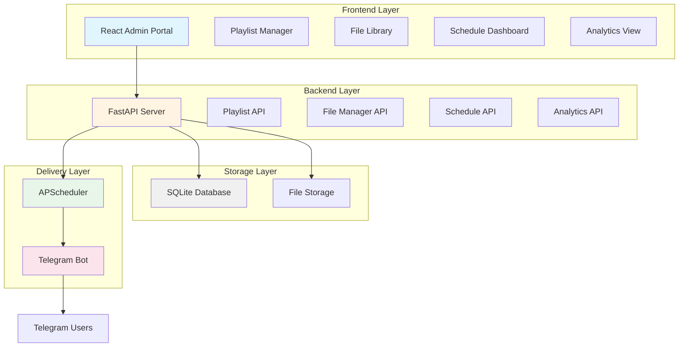

# Design Document: Advanced Scheduler and File Management

## Overview

This design extends the Officer Priya CDS System with comprehensive playlist management, file upload/storage capabilities, and advanced scheduling features. The enhancement transforms the system from a single-playlist video delivery service into a multi-playlist content management platform supporting various file types (PDFs, documents, images) with sophisticated scheduling options.

### Key Design Goals

1. **Scalability**: Support multiple playlists and schedules without performance degradation
2. **Flexibility**: Enable diverse content types and scheduling patterns
3. **Maintainability**: Extend existing architecture without breaking current functionality
4. **Security**: Validate and secure file uploads to prevent malicious content distribution
5. **User Experience**: Provide intuitive interfaces for both administrators and Telegram users

### System Context

The current system consists of:
- **Backend**: FastAPI application with SQLite database, APScheduler for scheduling, python-telegram-bot for Telegram integration
- **Frontend**: React application for administration
- **Deployment**: Render.com hosting with webhook-based Telegram bot

The enhancement will extend all three layers while maintaining backward compatibility with existing single-user functionality.

## Architecture

### High-Level Architecture



### Component Interaction Flow

**File Upload Flow**:
1. Admin uploads file via React interface
2. Frontend sends multipart/form-data to File Manager API
3. File Manager validates file type, size, and content
4. File stored with unique identifier in file system
5. Metadata stored in database
6. Frontend displays file in library

**Schedule Execution Flow**:
1. APScheduler triggers at configured time
2. Scheduler retrieves next content item from playlist
3. For files: File Manager retrieves file from storage
4. Telegram Bot sends content to all users
5. Delivery status recorded in database
6. User interactions (completed/help) recorded

### Technology Stack Extensions

**Backend Additions**:
- `python-magic` or `filetype` for MIME type validation
- File system storage with organized directory structure
- Extended SQLite schema for playlists, files, schedules

**Frontend Additions**:
- File upload component with drag-and-drop
- Playlist management interface
- Schedule configuration wizard
- Analytics dashboard with charts

## Components and Interfaces

### Database Schema

#### New Tables

**playlists**
```sql
CREATE TABLE playlists (
    id INTEGER PRIMARY KEY AUTOINCREMENT,
    name TEXT NOT NULL UNIQUE,
    description TEXT,
    created_at TIMESTAMP DEFAULT CURRENT_TIMESTAMP,
    updated_at TIMESTAMP DEFAULT CURRENT_TIMESTAMP
);
```

**files**
```sql
CREATE TABLE files (
    id INTEGER PRIMARY KEY AUTOINCREMENT,
    file_id TEXT NOT NULL UNIQUE,  -- UUID for file system storage
    original_name TEXT NOT NULL,
    file_type TEXT NOT NULL,  -- pdf, doc, docx, jpg, png, zip
    mime_type TEXT NOT NULL,
    file_size INTEGER NOT NULL,  -- bytes
    storage_path TEXT NOT NULL,
    uploaded_by TEXT,  -- future: admin user ID
    created_at TIMESTAMP DEFAULT CURRENT_TIMESTAMP
);

CREATE INDEX idx_files_type ON files(file_type);
CREATE INDEX idx_files_created ON files(created_at DESC);
```

**content_items**
```sql
CREATE TABLE content_items (
    id INTEGER PRIMARY KEY AUTOINCREMENT,
    playlist_id INTEGER NOT NULL,
    content_type TEXT NOT NULL CHECK (content_type IN ('video', 'file')),
    video_url TEXT,  -- for video type
    file_id INTEGER,  -- foreign key to files table
    caption TEXT,
    position INTEGER NOT NULL,  -- order within playlist
    created_at TIMESTAMP DEFAULT CURRENT_TIMESTAMP,
    FOREIGN KEY (playlist_id) REFERENCES playlists(id) ON DELETE CASCADE,
    FOREIGN KEY (file_id) REFERENCES files(id) ON DELETE RESTRICT
);

CREATE INDEX idx_content_items_playlist ON content_items(playlist_id, position);
```

**schedules**
```sql
CREATE TABLE schedules (
    id INTEGER PRIMARY KEY AUTOINCREMENT,
    name TEXT NOT NULL,
    playlist_id INTEGER NOT NULL,
    start_date DATE NOT NULL,
    end_date DATE,
    delivery_time TIME NOT NULL,
    frequency TEXT NOT NULL CHECK (frequency IN ('daily', 'weekdays', 'custom')),
    custom_days TEXT,  -- JSON array for custom days: [0,1,2,3,4,5,6]
    delivery_mode TEXT NOT NULL CHECK (delivery_mode IN ('sequential', 'all_at_once')),
    timezone TEXT DEFAULT 'UTC',
    status TEXT NOT NULL CHECK (status IN ('active', 'paused', 'completed', 'upcoming')),
    current_position INTEGER DEFAULT 0,  -- for sequential mode
    last_execution TIMESTAMP,
    next_execution TIMESTAMP,
    created_at TIMESTAMP DEFAULT CURRENT_TIMESTAMP,
    updated_at TIMESTAMP DEFAULT CURRENT_TIMESTAMP,
    FOREIGN KEY (playlist_id) REFERENCES playlists(id) ON DELETE RESTRICT
);

CREATE INDEX idx_schedules_status ON schedules(status);
CREATE INDEX idx_schedules_next_execution ON schedules(next_execution);
```

**deliveries**
```sql
CREATE TABLE deliveries (
    id INTEGER PRIMARY KEY AUTOINCREMENT,
    schedule_id INTEGER NOT NULL,
    content_item_id INTEGER NOT NULL,
    chat_id TEXT NOT NULL,
    delivery_status TEXT NOT NULL CHECK (delivery_status IN ('sent', 'failed', 'pending')),
    retry_count INTEGER DEFAULT 0,
    error_message TEXT,
    delivered_at TIMESTAMP,
    created_at TIMESTAMP DEFAULT CURRENT_TIMESTAMP,
    FOREIGN KEY (schedule_id) REFERENCES schedules(id) ON DELETE CASCADE,
    FOREIGN KEY (content_item_id) REFERENCES content_items(id) ON DELETE CASCADE
);

CREATE INDEX idx_deliveries_schedule ON deliveries(schedule_id);
CREATE INDEX idx_deliveries_chat ON deliveries(chat_id);
CREATE INDEX idx_deliveries_status ON deliveries(delivery_status);
```

**user_interactions**
```sql
CREATE TABLE user_interactions (
    id INTEGER PRIMARY KEY AUTOINCREMENT,
    delivery_id INTEGER NOT NULL,
    chat_id TEXT NOT NULL,
    interaction_type TEXT NOT NULL CHECK (interaction_type IN ('completed', 'help_requested')),
    created_at TIMESTAMP DEFAULT CURRENT_TIMESTAMP,
    FOREIGN KEY (delivery_id) REFERENCES deliveries(id) ON DELETE CASCADE
);

CREATE INDEX idx_user_interactions_delivery ON user_interactions(delivery_id);
CREATE INDEX idx_user_interactions_chat ON user_interactions(chat_id);
```

**file_references**
```sql
-- Track which playlists reference which files for safe deletion
CREATE TABLE file_references (
    id INTEGER PRIMARY KEY AUTOINCREMENT,
    file_id INTEGER NOT NULL,
    content_item_id INTEGER NOT NULL,
    created_at TIMESTAMP DEFAULT CURRENT_TIMESTAMP,
    FOREIGN KEY (file_id) REFERENCES files(id) ON DELETE CASCADE,
    FOREIGN KEY (content_item_id) REFERENCES content_items(id) ON DELETE CASCADE,
    UNIQUE(file_id, content_item_id)
);

CREATE INDEX idx_file_references_file ON file_references(file_id);
```

### Backend API Endpoints

#### Playlist Management

**GET /api/playlists**
- Returns: List of all playlists with content counts
- Response: `[{id, name, description, content_count, created_at, updated_at}]`

**POST /api/playlists**
- Body: `{name, description}`
- Returns: Created playlist object
- Validation: Name must be unique, non-empty

**GET /api/playlists/{playlist_id}**
- Returns: Playlist details with all content items
- Response: `{id, name, description, content_items: [{id, type, url/file, caption, position}]}`

**PUT /api/playlists/{playlist_id}**
- Body: `{name?, description?}`
- Returns: Updated playlist object

**DELETE /api/playlists/{playlist_id}**
- Validation: Fails if playlist has active schedules
- Returns: Success confirmation

#### File Management

**POST /api/files/upload**
- Content-Type: multipart/form-data
- Body: file (binary), caption (optional)
- Validation:
  - File type in [pdf, doc, docx, jpg, png, zip]
  - File size ≤ 50MB
  - MIME type matches extension
  - No executable extensions
- Returns: `{file_id, original_name, file_type, file_size, storage_path, created_at}`

**GET /api/files**
- Query params: type (optional), search (optional), limit, offset
- Returns: Paginated list of files with metadata
- Response: `{files: [{id, file_id, original_name, file_type, file_size, created_at}], total, page, pages}`

**GET /api/files/{file_id}**
- Returns: File metadata and reference count
- Response: `{id, file_id, original_name, file_type, file_size, reference_count, created_at}`

**GET /api/files/{file_id}/download**
- Returns: File binary with appropriate Content-Type header
- Security: Validates admin session

**DELETE /api/files/{file_id}**
- Validation: Fails if file is referenced in any playlist
- Returns: Success confirmation or list of referencing playlists

#### Content Item Management

**POST /api/playlists/{playlist_id}/content**
- Body: `{content_type: 'video'|'file', video_url?, file_id?, caption?, position?}`
- Validation: video_url required if type=video, file_id required if type=file
- Returns: Created content item

**PUT /api/playlists/{playlist_id}/content/{content_id}**
- Body: `{caption?, position?}`
- Returns: Updated content item

**DELETE /api/playlists/{playlist_id}/content/{content_id}**
- Returns: Success confirmation
- Note: Does not delete underlying file

**POST /api/playlists/{playlist_id}/content/reorder**
- Body: `{content_ids: [id1, id2, id3, ...]}`  -- new order
- Returns: Success confirmation

#### Schedule Management

**GET /api/schedules**
- Query params: status (optional), playlist_id (optional)
- Returns: List of schedules with next execution times
- Response: `[{id, name, playlist_name, start_date, end_date, delivery_time, frequency, status, next_execution, last_execution}]`

**POST /api/schedules**
- Body: `{name, playlist_id, start_date, end_date?, delivery_time, frequency, custom_days?, delivery_mode, timezone?}`
- Validation:
  - start_date not in past
  - end_date after start_date if provided
  - playlist_id exists
- Returns: Created schedule with calculated next_execution

**GET /api/schedules/{schedule_id}**
- Returns: Full schedule details
- Response: `{id, name, playlist_id, playlist_name, start_date, end_date, delivery_time, frequency, custom_days, delivery_mode, timezone, status, current_position, last_execution, next_execution, created_at, updated_at}`

**PUT /api/schedules/{schedule_id}**
- Body: Any schedule fields except id
- Validation: Cannot edit schedules with status='active' and last_execution not null
- Returns: Updated schedule

**PATCH /api/schedules/{schedule_id}/status**
- Body: `{status: 'active'|'paused'}`
- Returns: Updated schedule

**DELETE /api/schedules/{schedule_id}**
- Validation: Requires confirmation if status='active'
- Returns: Success confirmation

**GET /api/schedules/timeline**
- Query params: start_date, end_date
- Returns: All scheduled deliveries in date range
- Response: `[{date, time, schedule_id, schedule_name, playlist_name, content_count}]`

#### Analytics and Delivery History

**GET /api/analytics/deliveries**
- Query params: start_date, end_date, playlist_id?, schedule_id?
- Returns: Delivery statistics
- Response: `{total_deliveries, successful, failed, success_rate, deliveries_by_date: [{date, count}]}`

**GET /api/analytics/engagement**
- Query params: playlist_id?, schedule_id?
- Returns: User engagement metrics
- Response: `{total_sent, completed_count, completion_rate, help_requests, engagement_by_content: [{content_id, caption, sent, completed, help_requests}]}`

**GET /api/deliveries/history**
- Query params: limit, offset, chat_id?, schedule_id?, status?
- Returns: Paginated delivery history
- Response: `{deliveries: [{id, schedule_name, content_caption, chat_id, status, delivered_at, interactions}], total, page, pages}`

**POST /api/deliveries/export**
- Body: `{start_date, end_date, format: 'csv'|'json'}`
- Returns: File download with delivery history

### Frontend Components

#### New Components

**PlaylistManager** (`components/PlaylistManager.jsx`)
- Displays list of playlists in card/table view
- Create/Edit/Delete playlist functionality
- Click to view playlist details
- Shows content count and last modified date

**PlaylistDetail** (`components/PlaylistDetail.jsx`)
- Shows all content items in a playlist
- Drag-and-drop reordering
- Add content button (opens modal)
- Remove content items
- Edit captions

**FileLibrary** (`components/FileLibrary.jsx`)
- Grid/list view of uploaded files
- File upload area with drag-and-drop
- Search and filter by type
- File preview modal
- Delete with reference checking
- Download functionality

**FileUploader** (`components/FileUploader.jsx`)
- Drag-and-drop upload zone
- File type and size validation
- Upload progress indicator
- Multiple file support
- Preview before upload

**ContentItemModal** (`components/ContentItemModal.jsx`)
- Add video URL or select file from library
- Caption input
- File library browser within modal
- Validation feedback

**ScheduleManager** (`components/ScheduleManager.jsx`)
- Dashboard view of all schedules
- Status indicators (active, paused, upcoming, completed)
- Quick actions (pause/resume/delete)
- Next execution time display
- Create schedule button

**ScheduleForm** (`components/ScheduleForm.jsx`)
- Multi-step wizard for schedule creation
- Step 1: Basic info (name, playlist selection)
- Step 2: Date/time configuration
- Step 3: Frequency settings (daily, weekdays, custom)
- Step 4: Delivery mode (sequential vs all-at-once)
- Step 5: Review and confirm
- Validation at each step

**ScheduleTimeline** (`components/ScheduleTimeline.jsx`)
- Calendar view of scheduled deliveries
- Conflict highlighting
- Filter by playlist
- Click to view schedule details

**AnalyticsDashboard** (`components/AnalyticsDashboard.jsx`)
- Summary cards (total deliveries, success rate, engagement)
- Charts (deliveries over time, completion rates)
- Top performing content
- Recent help requests

**DeliveryHistory** (`components/DeliveryHistory.jsx`)
- Paginated table of deliveries
- Filters (date range, status, schedule)
- Export button
- Click to view delivery details

#### Modified Components

**App.jsx**
- Add navigation tabs for Playlists, Files, Schedules, Analytics
- Route management for new views
- Maintain existing functionality for backward compatibility

**AdminActions.jsx**
- Keep existing "Send Now" functionality
- Add link to new schedule management

### File Storage Strategy

#### Directory Structure

```
backend/
  uploads/
    files/
      {year}/
        {month}/
          {file_id}.{extension}
```

Example: `backend/uploads/files/2024/01/a1b2c3d4-e5f6-7890-abcd-ef1234567890.pdf`

#### File Naming Convention

- Generate UUID v4 for each file
- Store with original extension
- Maintain original filename in database only
- Prevents filename collisions and path traversal attacks

#### Storage Implementation

```python
# backend/file_manager.py
import uuid
import os
from pathlib import Path
from datetime import datetime
import magic  # python-magic for MIME detection

class FileManager:
    UPLOAD_DIR = Path("uploads/files")
    MAX_FILE_SIZE = 50 * 1024 * 1024  # 50MB
    ALLOWED_TYPES = {
        'pdf': 'application/pdf',
        'doc': 'application/msword',
        'docx': 'application/vnd.openxmlformats-officedocument.wordprocessingml.document',
        'jpg': 'image/jpeg',
        'jpeg': 'image/jpeg',
        'png': 'image/png',
        'zip': 'application/zip'
    }
    FORBIDDEN_EXTENSIONS = {'exe', 'bat', 'sh', 'cmd', 'app', 'com', 'scr'}
    
    def save_file(self, file_data, original_filename):
        # Validate extension
        # Validate size
        # Validate MIME type
        # Generate UUID
        # Create year/month directory
        # Save file
        # Return file metadata
        pass
    
    def get_file_path(self, file_id):
        # Query database for storage_path
        # Return full path
        pass
    
    def delete_file(self, file_id):
        # Check references
        # Delete from filesystem
        # Delete from database
        pass
```

### Telegram Bot Integration

#### Message Formatting

**Video Content**:
```
📹 CDS Preparation - Day {day_number}

{caption}

🔗 {video_url}

[Completed] [Need Help]
```

**File Content**:
```
📄 CDS Study Material

{caption}

[File attached]

[Completed] [Need Help]
```

#### Callback Handlers

```python
# backend/telegram_bot.py

async def handle_completed_callback(update, context):
    query = update.callback_query
    delivery_id = query.data.split(':')[1]
    chat_id = query.message.chat_id
    
    # Record interaction
    db.record_interaction(delivery_id, chat_id, 'completed')
    
    await query.answer("✅ Marked as completed!")
    await query.edit_message_reply_markup(reply_markup=None)

async def handle_help_callback(update, context):
    query = update.callback_query
    delivery_id = query.data.split(':')[1]
    chat_id = query.message.chat_id
    
    # Record interaction
    db.record_interaction(delivery_id, chat_id, 'help_requested')
    
    # Notify admins (future enhancement)
    
    await query.answer("🆘 Help request recorded. We'll reach out soon!")
```

#### File Sending Logic

```python
async def send_content_item(bot, chat_id, content_item, schedule_id):
    try:
        if content_item.content_type == 'video':
            message = await bot.send_message(
                chat_id=chat_id,
                text=format_video_message(content_item),
                reply_markup=get_interaction_keyboard(delivery_id)
            )
        elif content_item.content_type == 'file':
            file_path = file_manager.get_file_path(content_item.file_id)
            file_type = content_item.file.file_type
            
            if file_type in ['jpg', 'jpeg', 'png']:
                message = await bot.send_photo(
                    chat_id=chat_id,
                    photo=open(file_path, 'rb'),
                    caption=content_item.caption,
                    reply_markup=get_interaction_keyboard(delivery_id)
                )
            else:
                message = await bot.send_document(
                    chat_id=chat_id,
                    document=open(file_path, 'rb'),
                    caption=content_item.caption,
                    reply_markup=get_interaction_keyboard(delivery_id)
                )
        
        # Record successful delivery
        db.record_delivery(schedule_id, content_item.id, chat_id, 'sent')
        return True
        
    except Exception as e:
        # Log error and retry
        db.record_delivery(schedule_id, content_item.id, chat_id, 'failed', str(e))
        return False
```

## Data Models

### Python Models (Pydantic)

```python
# backend/models.py

from pydantic import BaseModel, Field, validator
from typing import Optional, List, Literal
from datetime import date, time, datetime

class PlaylistCreate(BaseModel):
    name: str = Field(..., min_length=1, max_length=100)
    description: Optional[str] = Field(None, max_length=500)

class PlaylistUpdate(BaseModel):
    name: Optional[str] = Field(None, min_length=1, max_length=100)
    description: Optional[str] = None

class PlaylistResponse(BaseModel):
    id: int
    name: str
    description: Optional[str]
    content_count: int
    created_at: datetime
    updated_at: datetime

class FileUploadResponse(BaseModel):
    id: int
    file_id: str
    original_name: str
    file_type: str
    mime_type: str
    file_size: int
    storage_path: str
    created_at: datetime

class ContentItemCreate(BaseModel):
    content_type: Literal['video', 'file']
    video_url: Optional[str] = None
    file_id: Optional[int] = None
    caption: Optional[str] = Field(None, max_length=1000)
    position: Optional[int] = None
    
    @validator('video_url')
    def validate_video_url(cls, v, values):
        if values.get('content_type') == 'video' and not v:
            raise ValueError('video_url required for video content')
        return v
    
    @validator('file_id')
    def validate_file_id(cls, v, values):
        if values.get('content_type') == 'file' and not v:
            raise ValueError('file_id required for file content')
        return v

class ContentItemResponse(BaseModel):
    id: int
    playlist_id: int
    content_type: str
    video_url: Optional[str]
    file_id: Optional[int]
    file_name: Optional[str]
    caption: Optional[str]
    position: int
    created_at: datetime

class ScheduleCreate(BaseModel):
    name: str = Field(..., min_length=1, max_length=100)
    playlist_id: int
    start_date: date
    end_date: Optional[date] = None
    delivery_time: time
    frequency: Literal['daily', 'weekdays', 'custom']
    custom_days: Optional[List[int]] = Field(None, description="0=Monday, 6=Sunday")
    delivery_mode: Literal['sequential', 'all_at_once']
    timezone: str = Field(default='UTC')
    
    @validator('end_date')
    def validate_end_date(cls, v, values):
        if v and 'start_date' in values and v < values['start_date']:
            raise ValueError('end_date must be after start_date')
        return v
    
    @validator('custom_days')
    def validate_custom_days(cls, v, values):
        if values.get('frequency') == 'custom' and not v:
            raise ValueError('custom_days required for custom frequency')
        if v and not all(0 <= day <= 6 for day in v):
            raise ValueError('custom_days must be integers 0-6')
        return v

class ScheduleResponse(BaseModel):
    id: int
    name: str
    playlist_id: int
    playlist_name: str
    start_date: date
    end_date: Optional[date]
    delivery_time: time
    frequency: str
    custom_days: Optional[List[int]]
    delivery_mode: str
    timezone: str
    status: str
    current_position: int
    last_execution: Optional[datetime]
    next_execution: Optional[datetime]
    created_at: datetime
    updated_at: datetime

class DeliveryResponse(BaseModel):
    id: int
    schedule_id: int
    schedule_name: str
    content_item_id: int
    content_caption: Optional[str]
    chat_id: str
    delivery_status: str
    retry_count: int
    error_message: Optional[str]
    delivered_at: Optional[datetime]
    interactions: List[dict]

class AnalyticsResponse(BaseModel):
    total_deliveries: int
    successful: int
    failed: int
    success_rate: float
    deliveries_by_date: List[dict]

class EngagementResponse(BaseModel):
    total_sent: int
    completed_count: int
    completion_rate: float
    help_requests: int
    engagement_by_content: List[dict]
```


## Correctness Properties

*A property is a characteristic or behavior that should hold true across all valid executions of a system—essentially, a formal statement about what the system should do. Properties serve as the bridge between human-readable specifications and machine-verifiable correctness guarantees.*

### Property Reflection

After analyzing all acceptance criteria, the following redundancies were identified and consolidated:

- **2.6 and 2.7**: Both test file size limit enforcement - combined into single property
- **5.8 and 6.7**: Both test execution time display - combined into single property
- **9.1 and 9.2**: Both test MIME type validation - combined into single comprehensive property

### Property 1: Playlist CRUD Operations

*For any* valid playlist data (name and optional description), creating a playlist through the API should result in that playlist being retrievable with the same data, and updating it with new valid data should persist those changes, and deleting it (when it has no schedules) should remove it from the system.

**Validates: Requirements 1.3, 1.4, 1.5, 1.6**

### Property 2: Playlist Deletion Protection

*For any* playlist that has one or more active schedules, attempting to delete that playlist should fail with an error indicating the playlist is in use.

**Validates: Requirements 1.7**

### Property 3: File Type Validation

*For any* file upload attempt, the system should accept only files with extensions in the allowed set {pdf, doc, docx, jpg, jpeg, png, zip} and reject all files with extensions in the forbidden set {exe, bat, sh, cmd, app, com, scr} or any extension not in the allowed set.

**Validates: Requirements 2.3, 2.4, 9.3**

### Property 4: File MIME Type Validation

*For any* uploaded file, the declared file extension must match the actual MIME type detected from file content, and mismatches should result in rejection.

**Validates: Requirements 9.1, 9.2**

### Property 5: File Size Limit Enforcement

*For any* file upload attempt, files with size ≤ 50MB should be accepted (if other validations pass) and files with size > 50MB should be rejected with an appropriate error message.

**Validates: Requirements 2.6, 2.7**

### Property 6: File Upload Round Trip

*For any* valid file that is successfully uploaded, the file should be stored with a unique identifier, and downloading that file using its identifier should return the exact same file content.

**Validates: Requirements 2.5, 3.7**

### Property 7: File Library Completeness

*For any* set of uploaded files, querying the file library should return all files with their complete metadata (name, type, size, upload date), and searching/filtering should return only files matching the search/filter criteria.

**Validates: Requirements 3.1, 3.2, 3.3**

### Property 8: File Deletion Protection

*For any* file that is referenced in one or more playlists, attempting to delete that file should fail with information about which playlists reference it, and files with zero references should be deletable.

**Validates: Requirements 3.5, 3.6**

### Property 9: Content Item Association

*For any* playlist and any file in the library, adding that file as a content item to the playlist should create an association such that retrieving the playlist returns that content item with the correct file reference.

**Validates: Requirements 4.4**

### Property 10: Content Item Caption Persistence

*For any* content item (video or file) with a specified caption, the caption should be stored and returned when retrieving the playlist or content item.

**Validates: Requirements 4.5**

### Property 11: Content Item Ordering

*For any* playlist with multiple content items, reordering those items should persist the new order such that subsequent retrievals return items in the updated order.

**Validates: Requirements 4.6**

### Property 12: Content Item Removal Preserves Files

*For any* content item that references a file, removing that content item from its playlist should remove the association but the underlying file should remain in the file library.

**Validates: Requirements 4.7, 4.8**

### Property 13: URL Validation

*For any* content item of type 'video', the video_url field must be a valid URL format, and invalid URL strings should be rejected.

**Validates: Requirements 4.3**

### Property 14: Multiple Schedule Creation

*For any* set of valid schedule configurations targeting different playlists, all schedules should be creatable and retrievable independently.

**Validates: Requirements 5.1**

### Property 15: Schedule Date Validation

*For any* schedule creation attempt, if the start_date is in the past, the creation should fail with a validation error, and if end_date is before start_date, the creation should fail with a validation error.

**Validates: Requirements 5.6, 5.7**

### Property 16: Schedule Execution Time Calculation

*For any* created schedule with valid parameters, the system should calculate and return the next_execution timestamp based on the start_date, delivery_time, frequency, and timezone.

**Validates: Requirements 5.8, 6.7**

### Property 17: Schedule Status Transitions

*For any* schedule with status 'active', updating its status to 'paused' should succeed and subsequent retrievals should show status 'paused', and updating back to 'active' should succeed.

**Validates: Requirements 6.2**

### Property 18: Schedule Edit Protection

*For any* schedule that has status 'active' and a non-null last_execution timestamp, attempting to edit its parameters should fail, and schedules with status 'upcoming' or null last_execution should be editable.

**Validates: Requirements 6.3, 6.4**

### Property 19: Schedule Deletion by Status

*For any* schedule with status 'upcoming' and null last_execution, deletion should succeed, and schedules with status 'active' should be deletable (with confirmation in UI).

**Validates: Requirements 6.5**

### Property 20: Delivery Statistics Accuracy

*For any* schedule with recorded deliveries, the statistics (total sent, successful, failed, success rate) should accurately reflect the counts in the deliveries table.

**Validates: Requirements 6.8, 12.5**

### Property 21: File Retrieval for Delivery

*For any* content item of type 'file' that is scheduled for delivery, the scheduler should be able to retrieve the file from storage using the file_id.

**Validates: Requirements 7.1**

### Property 22: File Type Delivery Mapping

*For any* file content item, if the file_type is in {jpg, jpeg, png}, it should be sent as a photo, and if file_type is in {pdf, doc, docx, zip}, it should be sent as a document.

**Validates: Requirements 7.2, 7.3, 7.4**

### Property 23: Delivery Retry Logic

*For any* delivery attempt that fails, the system should retry up to 3 times, and if all retries fail, the delivery should be marked as 'failed' and the system should continue with the next user.

**Validates: Requirements 7.5, 7.6**

### Property 24: Delivery Recording

*For any* successful content delivery to a user, a delivery record should be created in the database with status 'sent' and the delivery timestamp.

**Validates: Requirements 7.7**

### Property 25: User Interaction Recording

*For any* user interaction (clicking "Completed" or "Need Help"), an interaction record should be created in the database linked to the delivery_id with the correct interaction_type.

**Validates: Requirements 8.2, 8.3**

### Property 26: Caption Inclusion in Delivery

*For any* content item with a non-null caption, when delivered to users, the caption should be included in the message.

**Validates: Requirements 8.5**

### Property 27: Unique File Identifiers

*For any* set of uploaded files, all file_id values should be unique, preventing filename collisions.

**Validates: Requirements 9.4**

### Property 28: File Access Authentication

*For any* request to download a file, the request must include valid authentication credentials, and unauthenticated requests should be rejected.

**Validates: Requirements 9.6**

### Property 29: File Operation Logging

*For any* file upload or download operation, a log entry should be created with timestamp and user identifier.

**Validates: Requirements 9.7**

### Property 30: Schedule Conflict Detection

*For any* schedule creation attempt, if another schedule exists with the same delivery_time (within the same day), the system should detect and report the potential conflict.

**Validates: Requirements 10.1**

### Property 31: Timeline Completeness

*For any* date range query to the timeline API, all schedules with next_execution within that range should be included in the response.

**Validates: Requirements 10.4**

### Property 32: Playlist Duplication

*For any* playlist with content items, duplicating that playlist should create a new playlist with the same content items (same files/URLs and captions) but with a different playlist_id.

**Validates: Requirements 11.3**

### Property 33: Playlist Export/Import Round Trip

*For any* playlist with content items, exporting to JSON and then importing that JSON should create a playlist with equivalent content (same structure, content items, and captions).

**Validates: Requirements 11.4, 11.5**

### Property 34: Delivery History Completeness

*For any* set of deliveries in the database, querying the delivery history should return all deliveries, and filtering by date range, playlist, or content type should return only matching deliveries.

**Validates: Requirements 12.1, 12.4**

### Property 35: Completion Rate Calculation

*For any* content item with deliveries, the completion rate should equal (count of 'completed' interactions / count of deliveries) * 100.

**Validates: Requirements 12.2**

### Property 36: Help Request Count Accuracy

*For any* content item, the help request count should equal the count of interactions with interaction_type = 'help_requested' for that content item's deliveries.

**Validates: Requirements 12.3**

### Property 37: Delivery History Export

*For any* set of deliveries, exporting to CSV should produce a valid CSV file containing all delivery records with their timestamps, statuses, and associated metadata.

**Validates: Requirements 12.6**

## Error Handling

### File Upload Errors

**Invalid File Type**:
- HTTP 400 Bad Request
- Response: `{"error": "Invalid file type", "detail": "File type .exe is not allowed", "allowed_types": ["pdf", "doc", "docx", "jpg", "png", "zip"]}`

**File Too Large**:
- HTTP 413 Payload Too Large
- Response: `{"error": "File too large", "detail": "File size 52428800 bytes exceeds maximum 52428800 bytes", "max_size_mb": 50}`

**MIME Type Mismatch**:
- HTTP 400 Bad Request
- Response: `{"error": "MIME type mismatch", "detail": "File extension .pdf does not match detected MIME type image/jpeg"}`

**Storage Failure**:
- HTTP 500 Internal Server Error
- Response: `{"error": "Storage error", "detail": "Failed to save file to storage"}`
- Action: Log error, clean up partial uploads

### Playlist/Schedule Errors

**Playlist Not Found**:
- HTTP 404 Not Found
- Response: `{"error": "Playlist not found", "detail": "Playlist with id 123 does not exist"}`

**Playlist In Use**:
- HTTP 409 Conflict
- Response: `{"error": "Playlist in use", "detail": "Cannot delete playlist with active schedules", "schedule_ids": [1, 2, 3]}`

**Invalid Schedule Dates**:
- HTTP 400 Bad Request
- Response: `{"error": "Invalid dates", "detail": "Start date 2024-01-01 is in the past"}`

**Schedule Edit Forbidden**:
- HTTP 403 Forbidden
- Response: `{"error": "Cannot edit active schedule", "detail": "Schedule has already started execution"}`

### Delivery Errors

**File Not Found**:
- Log error: `ERROR: File not found for delivery - file_id: abc123, delivery_id: 456`
- Action: Mark delivery as failed, continue with next user

**Telegram API Error**:
- Log error: `ERROR: Telegram API error - chat_id: 123456, error: Bad Request: chat not found`
- Action: Retry up to 3 times with exponential backoff (1s, 2s, 4s)
- After 3 failures: Mark delivery as failed, record error message, continue

**Network Timeout**:
- Log error: `ERROR: Network timeout during delivery - chat_id: 123456, attempt: 2/3`
- Action: Retry with exponential backoff
- After 3 failures: Mark delivery as failed, continue

### Database Errors

**Constraint Violation**:
- HTTP 409 Conflict
- Response: `{"error": "Constraint violation", "detail": "Playlist name already exists"}`

**Foreign Key Violation**:
- HTTP 400 Bad Request
- Response: `{"error": "Invalid reference", "detail": "File with id 123 does not exist"}`

**Connection Error**:
- HTTP 503 Service Unavailable
- Response: `{"error": "Database unavailable", "detail": "Unable to connect to database"}`
- Action: Retry operation, if persistent, return 503

### Error Logging Strategy

All errors should be logged to the `error_logs` table with:
- Timestamp
- Error type (validation, storage, delivery, database, network)
- Error message
- Stack trace (for 500 errors)
- Context (user_id, file_id, schedule_id, etc.)

Critical errors (delivery failures, storage failures) should also be logged to a monitoring service for alerting.

## Testing Strategy

### Dual Testing Approach

This feature requires both unit testing and property-based testing for comprehensive coverage:

**Unit Tests**: Focus on specific examples, edge cases, and integration points
- Specific file upload scenarios (valid PDF, invalid EXE, oversized file)
- Schedule creation with specific dates
- Delivery to specific users
- Error handling for specific failure modes
- Integration between components (scheduler → file manager → telegram bot)

**Property-Based Tests**: Verify universal properties across all inputs
- All 37 correctness properties defined above
- Each property test should run minimum 100 iterations
- Use random generation for: playlists, files, schedules, content items, deliveries

### Property-Based Testing Configuration

**Library**: Use `hypothesis` for Python property-based testing

**Test Structure**:
```python
from hypothesis import given, strategies as st
import pytest

@given(
    playlist_name=st.text(min_size=1, max_size=100),
    description=st.text(max_size=500)
)
def test_property_1_playlist_crud(playlist_name, description):
    """
    Feature: advanced-scheduler-file-management
    Property 1: Playlist CRUD Operations
    
    For any valid playlist data, creating should result in retrievable
    playlist with same data, updates should persist, and deletion should
    remove from system.
    """
    # Create
    created = api.create_playlist(name=playlist_name, description=description)
    assert created.name == playlist_name
    assert created.description == description
    
    # Retrieve
    retrieved = api.get_playlist(created.id)
    assert retrieved.name == playlist_name
    assert retrieved.description == description
    
    # Update
    new_name = playlist_name + "_updated"
    updated = api.update_playlist(created.id, name=new_name)
    assert updated.name == new_name
    
    # Delete
    api.delete_playlist(created.id)
    with pytest.raises(NotFoundError):
        api.get_playlist(created.id)
```

**Minimum Iterations**: Configure hypothesis to run 100 examples per test:
```python
from hypothesis import settings

settings.register_profile("ci", max_examples=100)
settings.load_profile("ci")
```

**Custom Strategies**:
```python
# Generate valid file types
valid_file_types = st.sampled_from(['pdf', 'doc', 'docx', 'jpg', 'jpeg', 'png', 'zip'])

# Generate forbidden file types
forbidden_file_types = st.sampled_from(['exe', 'bat', 'sh', 'cmd', 'app', 'com', 'scr'])

# Generate valid file sizes (up to 50MB)
valid_file_sizes = st.integers(min_value=1, max_value=50*1024*1024)

# Generate oversized files
oversized_files = st.integers(min_value=50*1024*1024+1, max_value=100*1024*1024)

# Generate valid URLs
valid_urls = st.from_regex(r'https?://[a-z0-9.-]+\.[a-z]{2,}(/[a-zA-Z0-9._~:/?#\[\]@!$&\'()*+,;=-]*)?', fullmatch=True)

# Generate future dates
future_dates = st.dates(min_value=date.today() + timedelta(days=1))

# Generate past dates
past_dates = st.dates(max_value=date.today() - timedelta(days=1))

# Generate schedules
schedules = st.builds(
    ScheduleCreate,
    name=st.text(min_size=1, max_size=100),
    playlist_id=st.integers(min_value=1),
    start_date=future_dates,
    delivery_time=st.times(),
    frequency=st.sampled_from(['daily', 'weekdays', 'custom']),
    delivery_mode=st.sampled_from(['sequential', 'all_at_once'])
)
```

### Unit Test Coverage

**File Manager Tests** (`test_file_manager.py`):
- Upload valid PDF file
- Upload invalid EXE file (should reject)
- Upload oversized file (should reject)
- Upload file with MIME mismatch (should reject)
- Download uploaded file (should match original)
- Delete unreferenced file (should succeed)
- Delete referenced file (should fail)
- List files with pagination
- Search files by name
- Filter files by type

**Playlist Manager Tests** (`test_playlist_manager.py`):
- Create playlist with valid data
- Create playlist with duplicate name (should fail)
- Update playlist name and description
- Delete empty playlist
- Delete playlist with schedules (should fail)
- Add video content to playlist
- Add file content to playlist
- Reorder content items
- Remove content item (file should remain)

**Schedule Manager Tests** (`test_schedule_manager.py`):
- Create schedule with future start date
- Create schedule with past start date (should fail)
- Create schedule with end_date before start_date (should fail)
- Calculate next execution for daily schedule
- Calculate next execution for weekdays schedule
- Calculate next execution for custom days schedule
- Pause active schedule
- Resume paused schedule
- Edit upcoming schedule
- Edit active schedule (should fail)
- Delete upcoming schedule
- Detect schedule conflicts

**Delivery Tests** (`test_delivery.py`):
- Deliver video content to user
- Deliver PDF file to user (as document)
- Deliver image file to user (as photo)
- Handle delivery failure with retry
- Record successful delivery
- Record user completion interaction
- Record user help interaction
- Calculate completion rate
- Calculate help request count

**Analytics Tests** (`test_analytics.py`):
- Calculate delivery statistics
- Filter delivery history by date range
- Filter delivery history by playlist
- Export delivery history as CSV
- Export playlist as JSON
- Import playlist from JSON

### Integration Tests

**End-to-End Workflow Tests**:
1. Upload file → Add to playlist → Schedule delivery → Verify delivery recorded
2. Create playlist → Add multiple content items → Reorder → Verify order persists
3. Create schedule → Execute → Record interactions → Calculate analytics
4. Upload file → Add to multiple playlists → Attempt delete → Verify rejection with references

**Telegram Bot Integration Tests**:
- Mock Telegram API responses
- Test file sending with different file types
- Test retry logic with simulated failures
- Test callback button handling
- Test message formatting

### Test Data Management

**Fixtures** (`conftest.py`):
```python
@pytest.fixture
def test_db():
    """Create test database with schema"""
    db = Database("test.db")
    yield db
    os.remove("test.db")

@pytest.fixture
def sample_playlist(test_db):
    """Create sample playlist for testing"""
    return test_db.create_playlist(name="Test Playlist", description="Test")

@pytest.fixture
def sample_file(test_db):
    """Create sample file for testing"""
    file_data = b"Sample PDF content"
    return file_manager.save_file(file_data, "test.pdf")

@pytest.fixture
def sample_schedule(test_db, sample_playlist):
    """Create sample schedule for testing"""
    return test_db.create_schedule(
        name="Test Schedule",
        playlist_id=sample_playlist.id,
        start_date=date.today() + timedelta(days=1),
        delivery_time=time(9, 0),
        frequency='daily',
        delivery_mode='sequential'
    )
```

### Continuous Integration

**Test Execution**:
- Run all unit tests on every commit
- Run property-based tests on every commit (100 iterations each)
- Run integration tests on pull requests
- Generate coverage report (target: >85% coverage)

**Performance Tests**:
- Test file upload with 50MB file (should complete in <10s)
- Test playlist with 100 content items (should load in <2s)
- Test schedule execution with 1000 users (should complete in <5min)
- Test delivery history query with 10000 records (should return in <1s)

### Test Tagging

All property-based tests must include a comment tag referencing the design property:

```python
def test_property_1_playlist_crud():
    """
    Feature: advanced-scheduler-file-management
    Property 1: Playlist CRUD Operations
    """
    # Test implementation
```

This enables traceability from requirements → design properties → test implementation.

