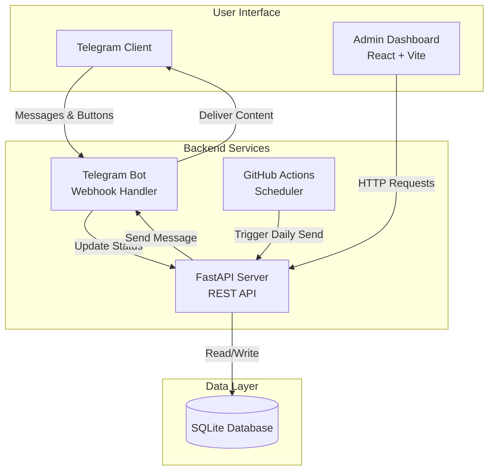

# Design Document: Officer Priya CDS Preparation Automation System

## Overview

The Officer Priya CDS Preparation Automation System is a distributed application consisting of three main components: a Telegram Bot for content delivery, a FastAPI backend for business logic and scheduling, and a React-based admin dashboard for monitoring and management. The system uses SQLite for data persistence and GitHub Actions for automated scheduling, all deployed on free-tier infrastructure.

The architecture follows a clear separation of concerns:
- **Telegram Bot**: User interaction layer (message delivery, button handling)
- **Backend Server**: Business logic, scheduling, data management
- **Admin Dashboard**: Visualization and administrative controls
- **Database**: Single source of truth for all state

## Architecture

### System Components



### Deployment Architecture

- **Frontend**: Vercel/Netlify (Static hosting, free tier)
- **Backend**: Render (Web service, free tier with 750 hours/month)
- **Scheduler**: GitHub Actions (Free tier, cron-based triggers)
- **Database**: SQLite file stored on Render persistent disk
- **Bot**: Telegram Bot API (Free, webhook-based)

### Data Flow

1. **Daily Automation Flow**:
   - GitHub Actions triggers at scheduled time
   - Calls Backend API endpoint `/api/send-daily`
   - Backend queries Database for current state
   - Backend selects next videos based on rotation logic
   - Backend calls Telegram Bot API to send message
   - Backend creates log entry with PENDING status
   - Backend increments day counter and video indices

2. **Completion Tracking Flow**:
   - User clicks button in Telegram
   - Telegram sends webhook to Backend
   - Backend validates callback data
   - Backend updates log entry status
   - Backend recalculates streak
   - Backend sends confirmation to Telegram
   - Dashboard polls and displays updated data

3. **Dashboard Interaction Flow**:
   - Dashboard polls Backend API every 5 seconds
   - Backend queries Database for current metrics
   - Backend calculates completion percentages
   - Backend returns JSON response
   - Dashboard updates UI reactively

## Components and Interfaces

### 1. Telegram Bot Component

**Responsibilities**:
- Send formatted daily messages
- Handle button callback queries
- Validate webhook signatures
- Send confirmation messages

**Interface**:
```python
class TelegramBot:
    def send_daily_message(
        self,
        chat_id: str,
        day: int,
        english_link: str,
        gk_link: str
    ) -> MessageResponse
    
    def handle_callback(
        self,
        callback_query: CallbackQuery
    ) -> bool
    
    def send_confirmation(
        self,
        chat_id: str,
        message: str
    ) -> bool
```

**Message Format**:
```
Officer Priya – Day {day_number}

📚 English: {video_link}
📖 GK ({subject}): {video_link}

Mark your completion:
[✅ Done] [❌ Not Done]
```

**Button Callback Data Format**:
```json
{
  "action": "complete",
  "day": 42,
  "status": "DONE"
}
```

### 2. Backend Server Component

**Responsibilities**:
- Execute daily video selection logic
- Manage video rotation and indexing
- Calculate streaks and completion percentages
- Provide REST API for dashboard
- Handle webhook callbacks from Telegram
- Persist all state changes to database

**REST API Endpoints**:

```python
# Daily automation
POST /api/send-daily
Response: {
    "success": bool,
    "day": int,
    "english_video": int,
    "gk_subject": str,
    "gk_video": int
}

# Webhook handler
POST /api/telegram/webhook
Body: TelegramUpdate
Response: {"ok": true}

# Dashboard data
GET /api/dashboard/metrics
Response: {
    "current_day": int,
    "overall_completion": float,
    "weekly_completion": float,
    "streak": int
}

GET /api/dashboard/logs
Query: ?limit=50&offset=0
Response: {
    "logs": [DailyLog],
    "total": int
}

# Configuration
GET /api/config/playlists
Response: {
    "english": str,
    "history": str,
    "polity": str,
    "geography": str,
    "economics": str
}

PUT /api/config/playlists
Body: {subject: str, url: str}
Response: {"success": bool}

# Admin actions
POST /api/admin/reset
Response: {"success": bool}

POST /api/admin/send-now
Response: {"success": bool, "day": int}
```

**Core Business Logic**:

```python
class VideoSelector:
    def select_next_english(self, current_index: int) -> tuple[int, str]:
        """Returns (video_number, video_url)"""
        
    def select_next_gk(
        self,
        rotation_index: int,
        subject_indices: dict[str, int]
    ) -> tuple[str, int, str]:
        """Returns (subject_name, video_number, video_url)"""
        
    def advance_rotation(self, current_index: int) -> int:
        """Returns next rotation index (0-3)"""

class StreakCalculator:
    def calculate_streak(self, logs: list[DailyLog]) -> int:
        """Calculate consecutive DONE days from most recent"""
        
    def update_streak_on_completion(
        self,
        current_streak: int,
        new_status: str,
        previous_day_status: str
    ) -> int:
        """Update streak based on new completion status"""

class CompletionCalculator:
    def calculate_overall(self, logs: list[DailyLog]) -> float:
        """Returns percentage of DONE days out of total days"""
        
    def calculate_weekly(self, logs: list[DailyLog]) -> float:
        """Returns percentage of DONE days in last 7 days"""
```

### 3. Admin Dashboard Component

**Responsibilities**:
- Display real-time metrics
- Show daily log table
- Provide playlist configuration UI
- Enable manual actions (reset, send now)
- Poll backend for updates

**React Component Structure**:

```typescript
// Main dashboard
function Dashboard() {
  const [metrics, setMetrics] = useState<Metrics>()
  const [logs, setLogs] = useState<DailyLog[]>()
  
  useEffect(() => {
    // Poll every 5 seconds
    const interval = setInterval(fetchData, 5000)
    return () => clearInterval(interval)
  }, [])
  
  return (
    <MetricsPanel metrics={metrics} />
    <LogsTable logs={logs} />
    <ConfigPanel />
    <AdminActions />
  )
}

// Metrics display
function MetricsPanel({ metrics }: Props) {
  return (
    <MetricCard title="Current Day" value={metrics.current_day} />
    <MetricCard title="Overall" value={`${metrics.overall_completion}%`} />
    <MetricCard title="Weekly" value={`${metrics.weekly_completion}%`} />
    <MetricCard title="Streak" value={`${metrics.streak} days`} icon="🔥" />
  )
}

// Daily logs table
function LogsTable({ logs }: Props) {
  return (
    <Table>
      <thead>
        <tr>
          <th>Day</th>
          <th>Date</th>
          <th>English #</th>
          <th>GK Subject</th>
          <th>GK #</th>
          <th>Status</th>
        </tr>
      </thead>
      <tbody>
        {logs.map(log => <LogRow key={log.day} log={log} />)}
      </tbody>
    </Table>
  )
}

// Configuration panel
function ConfigPanel() {
  const [playlists, setPlaylists] = useState<Playlists>()
  
  const handleUpdate = async (subject: string, url: string) => {
    await api.updatePlaylist(subject, url)
    // Refresh playlists
  }
  
  return (
    <PlaylistInput subject="English" value={playlists.english} onChange={handleUpdate} />
    // ... other subjects
  )
}

// Admin actions
function AdminActions() {
  const handleReset = async () => {
    if (confirm("Reset all progress?")) {
      await api.resetProgress()
    }
  }
  
  const handleSendNow = async () => {
    await api.sendNow()
  }
  
  return (
    <Button onClick={handleReset}>Reset Progress</Button>
    <Button onClick={handleSendNow}>Send Now</Button>
  )
}
```

### 4. Database Component

**Responsibilities**:
- Store all system state
- Provide ACID guarantees
- Enable efficient queries for metrics calculation

**Schema Design**:

```sql
-- Configuration table (single row)
CREATE TABLE config (
    id INTEGER PRIMARY KEY CHECK (id = 1),
    chat_id TEXT NOT NULL,
    english_playlist TEXT NOT NULL,
    history_playlist TEXT NOT NULL,
    polity_playlist TEXT NOT NULL,
    geography_playlist TEXT NOT NULL,
    economics_playlist TEXT NOT NULL,
    english_index INTEGER DEFAULT 0,
    history_index INTEGER DEFAULT 0,
    polity_index INTEGER DEFAULT 0,
    geography_index INTEGER DEFAULT 0,
    economics_index INTEGER DEFAULT 0,
    gk_rotation_index INTEGER DEFAULT 0,
    day_count INTEGER DEFAULT 0,
    streak INTEGER DEFAULT 0,
    created_at TIMESTAMP DEFAULT CURRENT_TIMESTAMP,
    updated_at TIMESTAMP DEFAULT CURRENT_TIMESTAMP
);

-- Daily logs table
CREATE TABLE daily_logs (
    id INTEGER PRIMARY KEY AUTOINCREMENT,
    day_number INTEGER NOT NULL UNIQUE,
    date TEXT NOT NULL,
    english_video_number INTEGER NOT NULL,
    gk_subject TEXT NOT NULL,
    gk_video_number INTEGER NOT NULL,
    status TEXT NOT NULL CHECK (status IN ('PENDING', 'DONE', 'NOT_DONE')),
    created_at TIMESTAMP DEFAULT CURRENT_TIMESTAMP,
    updated_at TIMESTAMP DEFAULT CURRENT_TIMESTAMP
);

-- Error logs table
CREATE TABLE error_logs (
    id INTEGER PRIMARY KEY AUTOINCREMENT,
    timestamp TIMESTAMP DEFAULT CURRENT_TIMESTAMP,
    error_type TEXT NOT NULL,
    error_message TEXT NOT NULL,
    stack_trace TEXT,
    context TEXT
);

-- Indexes for performance
CREATE INDEX idx_daily_logs_date ON daily_logs(date DESC);
CREATE INDEX idx_daily_logs_status ON daily_logs(status);
CREATE INDEX idx_error_logs_timestamp ON error_logs(timestamp DESC);
```

## Data Models

### Configuration Model

```python
from dataclasses import dataclass
from datetime import datetime

@dataclass
class Config:
    id: int = 1
    chat_id: str
    english_playlist: str
    history_playlist: str
    polity_playlist: str
    geography_playlist: str
    economics_playlist: str
    english_index: int = 0
    history_index: int = 0
    polity_index: int = 0
    geography_index: int = 0
    economics_index: int = 0
    gk_rotation_index: int = 0  # 0=History, 1=Polity, 2=Geography, 3=Economics
    day_count: int = 0
    streak: int = 0
    created_at: datetime
    updated_at: datetime
    
    def get_current_gk_subject(self) -> str:
        subjects = ["History", "Polity", "Geography", "Economics"]
        return subjects[self.gk_rotation_index]
    
    def get_gk_index(self, subject: str) -> int:
        mapping = {
            "History": self.history_index,
            "Polity": self.polity_index,
            "Geography": self.geography_index,
            "Economics": self.economics_index
        }
        return mapping[subject]
```

### Daily Log Model

```python
@dataclass
class DailyLog:
    id: int
    day_number: int
    date: str  # ISO format YYYY-MM-DD
    english_video_number: int
    gk_subject: str
    gk_video_number: int
    status: str  # PENDING, DONE, NOT_DONE
    created_at: datetime
    updated_at: datetime
    
    def is_completed(self) -> bool:
        return self.status == "DONE"
    
    def is_pending(self) -> bool:
        return self.status == "PENDING"
```

### Metrics Model

```python
@dataclass
class DashboardMetrics:
    current_day: int
    overall_completion: float  # 0-100
    weekly_completion: float   # 0-100
    streak: int
    total_days: int
    completed_days: int
    
    @classmethod
    def from_logs(cls, config: Config, logs: list[DailyLog]) -> "DashboardMetrics":
        total = len(logs)
        completed = sum(1 for log in logs if log.is_completed())
        overall = (completed / total * 100) if total > 0 else 0.0
        
        recent_7 = logs[-7:] if len(logs) >= 7 else logs
        weekly_completed = sum(1 for log in recent_7 if log.is_completed())
        weekly = (weekly_completed / len(recent_7) * 100) if recent_7 else 0.0
        
        return cls(
            current_day=config.day_count,
            overall_completion=round(overall, 1),
            weekly_completion=round(weekly, 1),
            streak=config.streak,
            total_days=total,
            completed_days=completed
        )
```

### Telegram Models

```python
@dataclass
class CallbackQuery:
    id: str
    from_user: dict
    message: dict
    data: str  # JSON string
    
    def parse_data(self) -> dict:
        return json.loads(self.data)

@dataclass
class MessageResponse:
    ok: bool
    result: dict
    message_id: int
```

## Correctness Properties

*A property is a characteristic or behavior that should hold true across all valid executions of a system—essentially, a formal statement about what the system should do. Properties serve as the bridge between human-readable specifications and machine-verifiable correctness guarantees.*

### Property 1: Video Index Monotonicity

*For any* sequence of daily sends, the English video index should increase by exactly 1 with each send (wrapping to 0 when exceeding playlist length).

**Validates: Requirements 1.6**

### Property 2: GK Rotation Cycle Consistency

*For any* sequence of daily sends, the GK subjects should follow the exact rotation pattern History → Polity → Geography → Economics → History without skips or duplicates.

**Validates: Requirements 1.8**

### Property 3: Day Counter Monotonicity

*For any* sequence of operations (automated or manual sends), the day counter should increase monotonically and never decrease except during explicit reset.

**Validates: Requirements 1.1, 8.3**

### Property 4: Status Update Idempotence

*For any* daily log entry, updating the status multiple times with the same value should result in the same final state as updating once.

**Validates: Requirements 2.5**

### Property 5: Streak Calculation Correctness

*For any* sequence of daily logs, the calculated streak should equal the count of consecutive DONE entries from the most recent day backward, stopping at the first NOT_DONE or PENDING entry.

**Validates: Requirements 3.1, 3.2, 3.3, 3.4**

### Property 6: Completion Percentage Bounds

*For any* set of daily logs, the overall completion percentage should be between 0 and 100 inclusive, and equal to (count of DONE logs / total logs) × 100.

**Validates: Requirements 4.2**

### Property 7: Weekly Completion Calculation

*For any* set of daily logs, the weekly completion percentage should only consider the most recent 7 days and should be between 0 and 100 inclusive.

**Validates: Requirements 4.3**

### Property 8: Log Entry Uniqueness

*For any* day number, there should exist at most one daily log entry with that day number in the database.

**Validates: Requirements 5.2**

### Property 9: Playlist URL Validation

*For any* playlist URL update, if the URL does not match the YouTube playlist format pattern, the system should reject it and preserve the previous URL.

**Validates: Requirements 6.2, 6.5**

### Property 10: Reset Completeness

*For any* reset operation, all video indices, the day counter, the streak counter, and the GK rotation index should be set to 0, and the daily logs table should be empty.

**Validates: Requirements 7.2, 7.3, 7.4, 7.5, 7.6**

### Property 11: Manual Send Deduplication

*For any* day, if a manual send is triggered multiple times, only one daily log entry should be created for that day.

**Validates: Requirements 8.5**

### Property 12: State Persistence

*For any* configuration or log update, if the database write succeeds, then immediately reading the same data should return the updated value.

**Validates: Requirements 10.3**

### Property 13: Callback Data Integrity

*For any* Telegram callback received, the parsed day number should match an existing daily log entry, otherwise the callback should be rejected.

**Validates: Requirements 11.4**

### Property 14: Dashboard Polling Freshness

*For any* database update, the dashboard should reflect the change within 5 seconds when polling is active.

**Validates: Requirements 13.1**

### Property 15: Video Index Wrapping

*For any* subject playlist, when the video index equals or exceeds the playlist length, selecting the next video should wrap the index to 0.

**Validates: Requirements 15.2**

### Property 16: State Restoration After Restart

*For any* backend server restart, the loaded configuration should match the last persisted state before shutdown.

**Validates: Requirements 16.1, 16.2**

## Error Handling

### Error Categories

1. **Network Errors**:
   - Telegram API unreachable
   - Database connection failures
   - GitHub Actions webhook failures

2. **Data Errors**:
   - Invalid playlist URLs
   - Corrupted database state
   - Missing configuration

3. **Business Logic Errors**:
   - Duplicate day sends
   - Invalid status transitions
   - Out-of-bounds video indices

### Error Handling Strategies

**Retry Logic**:
```python
class RetryConfig:
    max_attempts: int = 3
    base_delay: float = 1.0  # seconds
    max_delay: float = 60.0
    exponential_base: float = 2.0

async def retry_with_backoff(
    func: Callable,
    config: RetryConfig,
    error_types: tuple = (Exception,)
) -> Any:
    """Execute function with exponential backoff retry"""
    for attempt in range(config.max_attempts):
        try:
            return await func()
        except error_types as e:
            if attempt == config.max_attempts - 1:
                raise
            delay = min(
                config.base_delay * (config.exponential_base ** attempt),
                config.max_delay
            )
            await asyncio.sleep(delay)
```

**Error Logging**:
```python
class ErrorLogger:
    def log_error(
        self,
        error_type: str,
        error_message: str,
        stack_trace: str,
        context: dict
    ):
        """Persist error to database and optionally alert admin"""
        db.execute(
            "INSERT INTO error_logs (error_type, error_message, stack_trace, context) "
            "VALUES (?, ?, ?, ?)",
            (error_type, error_message, stack_trace, json.dumps(context))
        )
        
        # Critical errors trigger admin notification
        if error_type in ["DATABASE_FAILURE", "TELEGRAM_AUTH_FAILURE"]:
            self.notify_admin(error_message)
```

**Graceful Degradation**:
- If Telegram API fails, queue message for retry
- If database is locked, wait and retry with backoff
- If playlist URL is invalid, skip that subject and log error
- If GitHub Actions fails, allow manual trigger as fallback

## Testing Strategy

### Unit Testing

**Focus Areas**:
- Video selection logic with various rotation states
- Streak calculation with different completion patterns
- Completion percentage calculations
- URL validation logic
- Database query correctness
- Error handling paths

**Example Unit Tests**:
```python
def test_video_selector_english_sequential():
    """Test English video selection increments sequentially"""
    selector = VideoSelector()
    video_num, url = selector.select_next_english(current_index=5)
    assert video_num == 6

def test_streak_calculator_consecutive_done():
    """Test streak calculation with consecutive DONE days"""
    logs = [
        DailyLog(day_number=1, status="DONE"),
        DailyLog(day_number=2, status="DONE"),
        DailyLog(day_number=3, status="DONE"),
    ]
    calculator = StreakCalculator()
    assert calculator.calculate_streak(logs) == 3

def test_streak_calculator_broken_by_not_done():
    """Test streak resets after NOT_DONE"""
    logs = [
        DailyLog(day_number=1, status="DONE"),
        DailyLog(day_number=2, status="NOT_DONE"),
        DailyLog(day_number=3, status="DONE"),
    ]
    calculator = StreakCalculator()
    assert calculator.calculate_streak(logs) == 1

def test_playlist_url_validation_valid():
    """Test valid YouTube playlist URL passes validation"""
    validator = PlaylistValidator()
    assert validator.is_valid("https://www.youtube.com/playlist?list=PLxxx")

def test_playlist_url_validation_invalid():
    """Test invalid URL fails validation"""
    validator = PlaylistValidator()
    assert not validator.is_valid("https://example.com/not-youtube")
```

### Property-Based Testing

**Configuration**:
- Use `hypothesis` library for Python backend
- Minimum 100 iterations per property test
- Each test tagged with feature name and property number

**Property Test Examples**:

```python
from hypothesis import given, strategies as st

@given(st.integers(min_value=0, max_value=1000))
def test_property_video_index_monotonicity(start_index: int):
    """
    Feature: officer-priya-cds-system, Property 1:
    Video index increases by 1 with each send
    """
    selector = VideoSelector()
    next_index, _ = selector.select_next_english(start_index)
    assert next_index == start_index + 1

@given(st.lists(st.sampled_from(["DONE", "NOT_DONE", "PENDING"]), min_size=1, max_size=100))
def test_property_streak_calculation_correctness(statuses: list[str]):
    """
    Feature: officer-priya-cds-system, Property 5:
    Streak equals consecutive DONE from most recent
    """
    logs = [
        DailyLog(day_number=i+1, status=status, date=f"2024-01-{i+1:02d}",
                 english_video_number=i, gk_subject="History", gk_video_number=i)
        for i, status in enumerate(statuses)
    ]
    calculator = StreakCalculator()
    streak = calculator.calculate_streak(logs)
    
    # Manually calculate expected streak
    expected = 0
    for log in reversed(logs):
        if log.status == "DONE":
            expected += 1
        else:
            break
    
    assert streak == expected

@given(st.lists(st.sampled_from(["DONE", "NOT_DONE", "PENDING"]), min_size=1, max_size=100))
def test_property_completion_percentage_bounds(statuses: list[str]):
    """
    Feature: officer-priya-cds-system, Property 6:
    Completion percentage is between 0 and 100
    """
    logs = [
        DailyLog(day_number=i+1, status=status, date=f"2024-01-{i+1:02d}",
                 english_video_number=i, gk_subject="History", gk_video_number=i)
        for i, status in enumerate(statuses)
    ]
    config = Config(chat_id="123", english_playlist="", history_playlist="",
                    polity_playlist="", geography_playlist="", economics_playlist="")
    metrics = DashboardMetrics.from_logs(config, logs)
    
    assert 0 <= metrics.overall_completion <= 100
    assert 0 <= metrics.weekly_completion <= 100

@given(st.integers(min_value=0, max_value=3))
def test_property_gk_rotation_cycle_consistency(start_rotation: int):
    """
    Feature: officer-priya-cds-system, Property 2:
    GK rotation follows History → Polity → Geography → Economics → History
    """
    selector = VideoSelector()
    subjects = ["History", "Polity", "Geography", "Economics"]
    
    current = start_rotation
    for _ in range(8):  # Test two full cycles
        next_rotation = selector.advance_rotation(current)
        assert next_rotation == (current + 1) % 4
        current = next_rotation

@given(st.integers(min_value=1, max_value=1000))
def test_property_log_entry_uniqueness(day_number: int):
    """
    Feature: officer-priya-cds-system, Property 8:
    Each day number has at most one log entry
    """
    db = Database(":memory:")
    log1 = DailyLog(day_number=day_number, status="PENDING", date="2024-01-01",
                    english_video_number=1, gk_subject="History", gk_video_number=1)
    db.insert_log(log1)
    
    # Attempting to insert duplicate should fail
    log2 = DailyLog(day_number=day_number, status="DONE", date="2024-01-01",
                    english_video_number=2, gk_subject="Polity", gk_video_number=1)
    with pytest.raises(sqlite3.IntegrityError):
        db.insert_log(log2)
```

### Integration Testing

**Test Scenarios**:
1. End-to-end daily send flow (GitHub Actions → Backend → Telegram → Database)
2. Completion tracking flow (Telegram callback → Backend → Database → Dashboard)
3. Manual send with immediate dashboard update
4. Reset operation clearing all state
5. Playlist update with index reset

**Integration Test Example**:
```python
async def test_integration_daily_send_flow():
    """Test complete daily send workflow"""
    # Setup
    db = Database(":memory:")
    bot = TelegramBot(token=TEST_TOKEN)
    backend = BackendServer(db, bot)
    
    # Trigger daily send
    response = await backend.send_daily()
    
    # Verify database state
    config = db.get_config()
    assert config.day_count == 1
    assert config.english_index == 1
    
    logs = db.get_all_logs()
    assert len(logs) == 1
    assert logs[0].status == "PENDING"
    
    # Verify Telegram message sent
    assert bot.last_message_sent is not None
    assert "Day 1" in bot.last_message_sent.text
```

### Testing Configuration

- **Unit tests**: Run on every commit via GitHub Actions
- **Property tests**: 100 iterations minimum, run on every commit
- **Integration tests**: Run on pull requests
- **Manual testing**: Dashboard UI and Telegram interaction before deployment

### Test Coverage Goals

- Backend business logic: 90%+ coverage
- Database operations: 100% coverage
- API endpoints: 85%+ coverage
- Frontend components: 70%+ coverage (focus on logic, not UI rendering)
